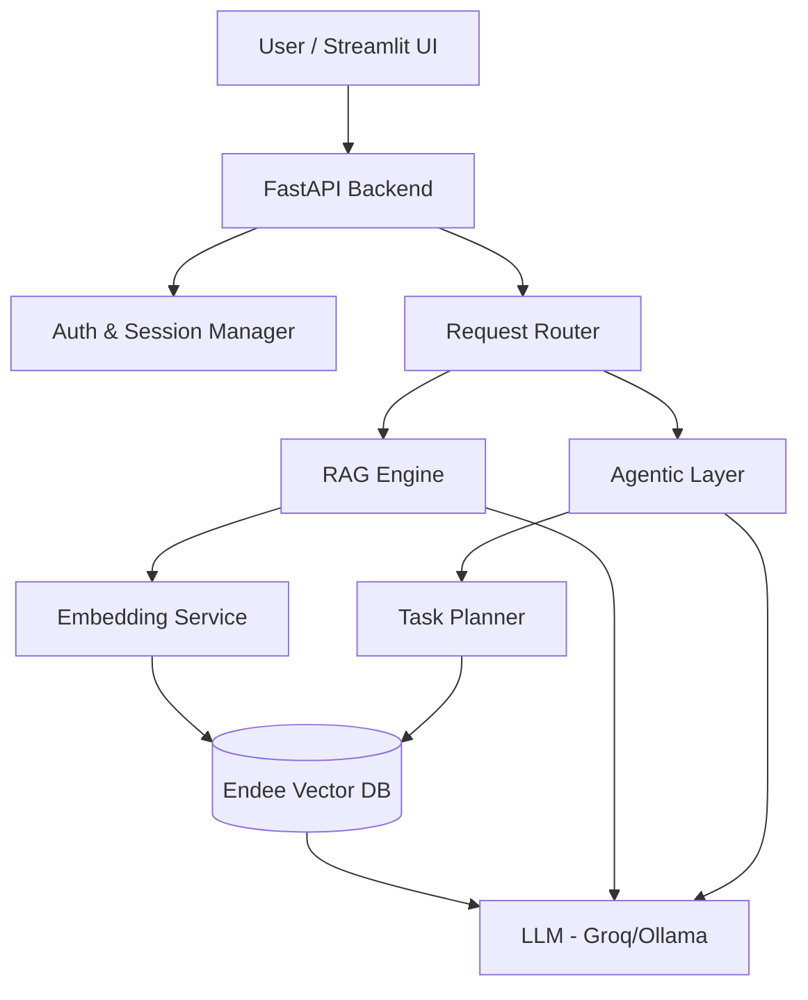
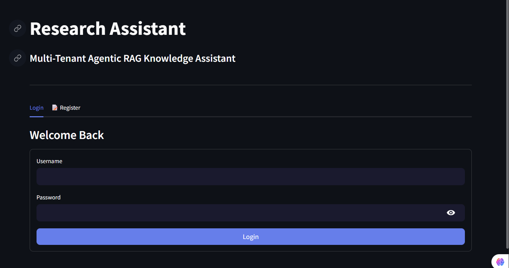
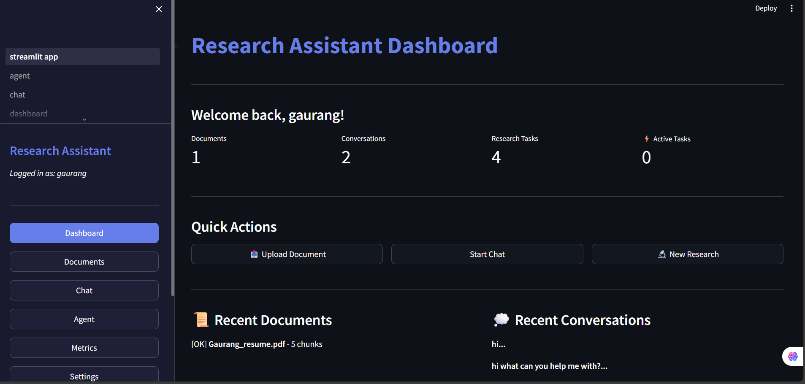
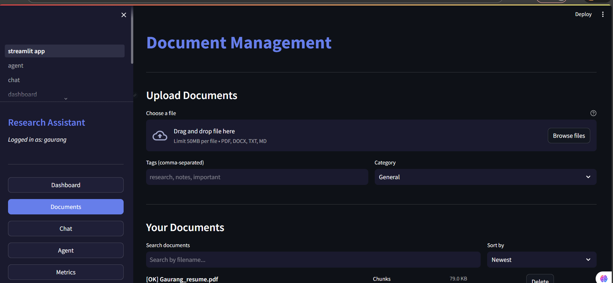
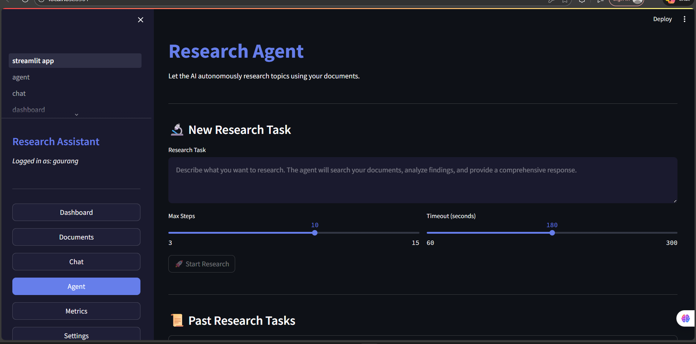
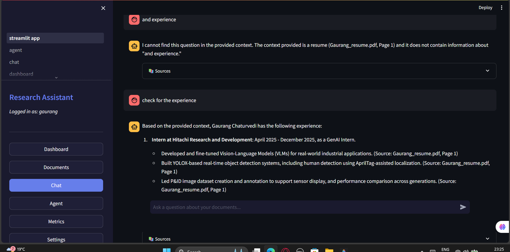
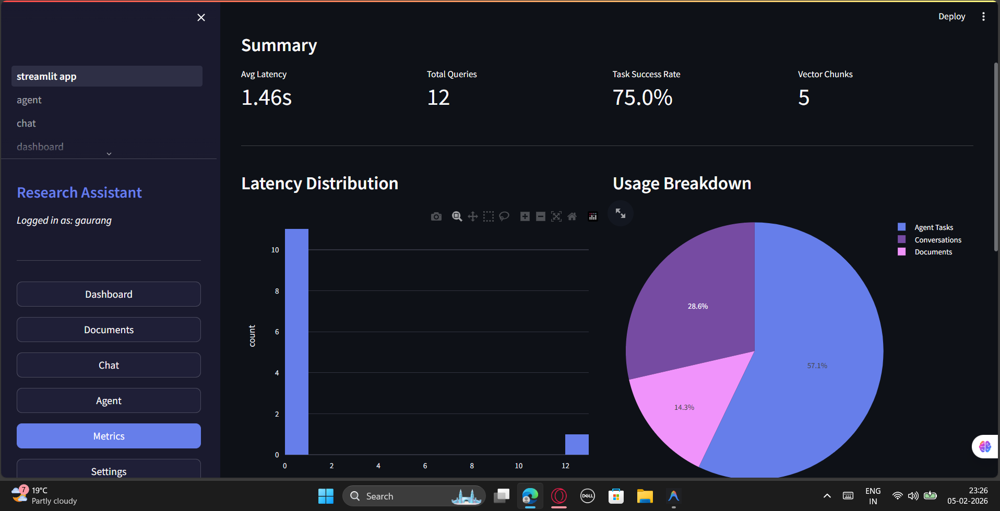

# Multi-Tenant Agentic RAG Research Assistant

A production-ready research assistant combining RAG (Retrieval-Augmented Generation) with autonomous AI agents, built on the Endee vector database.

## Project Overview

Modern teams deal with large volumes of technical documents and rapidly changing external research. Traditional keyword search misses context, and standard chatbots lack memory of your private data.

**This Agentic RAG Research Assistant solves these problems by providing:**
- **Grounded Answers**: Responses backed by your uploaded documents (PDF, DOCX, TXT, MD).
- **Autonomous Research**: AI agents that plan and execute multi-step research tasks.
- **Semantic Memory**: Long-term retention of conversations and findings using Endee.
- **Multi-Tenancy**: Complete data isolation for every user.
- **Transparent Metrics**: Real-time tracking of retrieval accuracy and latency.

### Problem Statement

| Problem | Our Solution |
|---------|--------------|
| **Information Overload** | Semantic search retrieves exact answers, not just keywords. |
| **Hallucinations** | RAG ensures every claim is cited from your documents. |
| **Lost Context** | Endee vector memory maintains long-term conversation history. |
| **Complex Research** | Autonomous agents break down broad questions into executable steps. |

---

## System Design & Technical Approach

### High-Level Architecture

The system is built on a **FastAPI** backend and **Streamlit** frontend, centered around the **Endee Vector Database** for all semantic memory.



### Core Components

1.  **Endee Vector Database**: The semantic backbone. It stores:
    *   `user_{id}_docs`: Document chunks and embeddings.
    *   `user_{id}_memory`: Conversation history and summaries.
    *   `user_{id}_agent`: Agent reasoning traces and research findings.
    *   *Key Feature*: **Multi-tenancy** is enforced via namespace prefixes, ensuring 100% data isolation.

2.  **RAG Engine (Retrieval-Augmented Generation)**:
    *   **Ingestion**: Parses documents $\rightarrow$ Chunks (500 chars) $\rightarrow$ Embeddings (SentenceTransformers).
    *   **Retrieval**: Hybrid search (Dense Vector + Keyword) to find top-K relevant chunks.
    *   **Generation**: LLM synthesizes answers with strict citations.

3.  **Agentic Layer (The "Brain")**:
    *   Uses a **Think-Plan-Act-Reflect** loop.
    *   **Planner**: Decomposes complex queries (e.g., "Compare X and Y") into sub-tasks.
    *   **Executor**: Calls tools (Vector Search, Web Search, Summarizer) to gather data.
    *   **Reflector**: Verifies if the answer satisfies the user's intent before responding.

4.  **Frontend & Monitoring**:
    *   **Streamlit**: Provides a reactive UI for chat, uploads, and dashboards.
    *   **Metrics**: Tracks query latency, token usage, and retrieval precision in real-time.

---

## Demo Link
[](https://agentic-rag-research-assistant-blvrdddmuvk849tpyptkxs.streamlit.app/)


## Screenshots

### Login Page


### Dashboard


### Document Upload


### Research Agent


### Agent Chat


### Metrics Dashboard



---

## Quick Start

### Prerequisites
- Python 3.10+
- Git
- 8GB RAM minimum

### Installation

```bash
# Clone repository
git clone https://github.com/Ashwadhama2004/agentic-rag-research-assistant.git
cd agentic-rag-research-assistant

# Create virtual environment
python -m venv venv

# Activate (Windows)
venv\Scripts\activate

# Activate (macOS/Linux)
source venv/bin/activate

# Install dependencies
pip install -r requirements.txt
```

### LLM Setup (Choose ONE Option)

#### Option A: Groq API (Recommended - Cloud)
1. Sign up at https://console.groq.com
2. Generate an API key
3. Create `.env` file:
```bash
LLM_PROVIDER=groq
GROQ_API_KEY=gsk_your_api_key_here
LLM_MODEL=llama-3.1-8b-instant
```

#### Option B: Ollama (Local - No API Key Required)
If you don't have a Groq API key, use Ollama for completely local inference:

1. Download and install Ollama from https://ollama.ai
2. Download the Llama model:
```bash
ollama pull llama3.1
```
3. Start Ollama server:
```bash
ollama serve
```
4. Create `.env` file:
```bash
LLM_PROVIDER=ollama
OLLAMA_BASE_URL=http://localhost:11434
LLM_MODEL=llama3.1
```

### Endee Vector Database Server (Required for Production)

The application uses Endee as its vector database. For full functionality, run the Endee server:

```bash
# Start Endee server using Docker
docker run -d -p 8080:8080 -v endee-data:/data --name endee-server endeeio/endee-server:latest

# Verify it's running
curl http://localhost:8080/api/v1/index/list
# Should return: {"indexes":[]}

# Stop the server (when needed)
docker stop endee-server

# Remove container (to recreate)
docker rm endee-server
```

> **Note**: Without the Endee server, the app falls back to local file storage (pickle files). This works for development but the Endee server is recommended for production use.

### Run the Application

```bash
streamlit run frontend/streamlit_app.py
```

Open http://localhost:8501 in your browser.

---

## Core Features

| Feature | Description |
|---------|-------------|
| **Document Upload** | PDF, DOCX, TXT, MD support with automatic chunking |
| **RAG Chat** | Semantic search with citation-backed answers |
| **Agent Research** | Multi-step autonomous research tasks |
| **Multi-Tenancy** | Per-user data isolation via Endee collections |
| **Performance Metrics** | Query latency, retrieval accuracy tracking |

---

## Endee Vector Database Integration

Endee (https://github.com/EndeeLabs/endee) serves as the **semantic memory backbone** for the entire research assistant system. It is a high-performance, open-source vector database designed for speed and efficiency.

### Document Processing Pipeline

```
┌─────────────┐     ┌─────────────┐     ┌─────────────┐     ┌─────────────┐
│   Upload    │ ──▶ │  Chunking   │ ──▶ │  Embedding  │ ──▶ │   Endee     │
│  Document   │     │  (500 char) │     │  (384-dim)  │     │   Storage   │
└─────────────┘     └─────────────┘     └─────────────┘     └─────────────┘
```

1. **Document Upload**: User uploads PDF, DOCX, TXT, or MD file
2. **Text Extraction**: PyPDF2/python-docx extracts text content
3. **Chunking**: Text is split into 500-character chunks with 50-char overlap
4. **Embedding**: SentenceTransformers (all-MiniLM-L6-v2) generates 384-dim vectors
5. **Storage**: Vectors stored in user-specific Endee collection

### Query Processing Pipeline

```
┌─────────────┐     ┌─────────────┐     ┌─────────────┐     ┌─────────────┐
│   Query     │ ──▶ │  Embedding  │ ──▶ │   Endee     │ ──▶ │    LLM      │
│   Input     │     │  Generation │     │   Search    │     │   Answer    │
└─────────────┘     └─────────────┘     └─────────────┘     └─────────────┘
```

1. **Query Input**: User asks a question
2. **Query Embedding**: Same embedding model generates query vector
3. **Vector Search**: Endee finds top-K similar chunks using cosine similarity
4. **Answer Generation**: LLM (Groq/Ollama) generates answer with retrieved context

### Multi-Tenant Architecture

Each user has completely isolated data through separate Endee collections:

| Collection | Purpose |
|------------|---------|
| `user_{id}_docs` | Document chunks and embeddings |
| `user_{id}_memory` | Conversation summaries for long-term memory |
| `user_{id}_agent` | Agent research findings and reasoning chains |

This architecture ensures:
- **Data Privacy**: Users only access their own documents
- **No Cross-Contamination**: Queries never return other users' data
- **Scalable Isolation**: New users automatically get their own namespace

### Client Implementation

The Endee client (`backend/app/endee_client/client.py`) supports dual modes:

| Mode | Use Case | Storage |
|------|----------|---------|
| **HTTP Mode** | Production with Endee server | REST API to Endee |
| **File-Based Mode** | Streamlit Cloud / Development | Local pickle files |

```python
# Automatic fallback
client = EndeeClient()
client.add_document(collection, doc_id, vector, metadata)
results = client.search(collection, query_vector, top_k=3)
```

---

## Technology Stack

| Layer | Technologies |
|-------|--------------|
| **Backend** | FastAPI, SQLAlchemy, Pydantic |
| **AI/ML** | SentenceTransformers (all-MiniLM-L6-v2), Groq/Ollama (Llama 3.1) |
| **Vector DB** | Endee (github.com/EndeeLabs/endee) |
| **Frontend** | Streamlit, Plotly |
| **Auth** | JWT tokens, SHA-256 password hashing |

---

## Project Structure

```
endee_company_task/
├── backend/app/
│   ├── agents/        # Agentic AI (base_agent, planner, executor, tools)
│   ├── rag/           # RAG engine (chunker, embedder, retriever, generator)
│   ├── memory/        # Short-term and long-term memory management
│   ├── endee_client/  # Vector database wrapper with HTTP/file fallback
│   ├── auth/          # Authentication (users, sessions, security)
│   └── database/      # SQLAlchemy models and connections
├── frontend/
│   ├── streamlit_app.py
│   └── pages/         # Dashboard, Documents, Chat, Agent, Metrics, Settings
├── images/            # Screenshots and demo video
├── data/              # SQLite DB and Endee vector storage
└── requirements.txt
```

---

## Implementation Timeline (9 Days)

### Phase 1: Foundation & Setup (Days 1-2)
| Day | Tasks Completed |
|-----|-----------------|
| **Day 1** | Project initialization, folder structure, database schema (SQLAlchemy models), Endee client wrapper development, basic authentication models |
| **Day 2** | Document parsing (PDF, DOCX, TXT, MD), document chunking with recursive character splitter, embedding generation setup, FastAPI application initialization |

### Phase 2: RAG Engine Development (Days 3-4)
| Day | Tasks Completed |
|-----|-----------------|
| **Day 3** | Vector retrieval implementation with top-K search, reranking logic for relevance scoring, LLM integration with Groq/Ollama, prompt engineering for RAG, chat query endpoint |
| **Day 4** | Short-term memory for conversation context, long-term memory with summary generation, memory consolidation service, performance optimization, unit tests for RAG components |

### Phase 3: Agentic Layer (Days 5-6)
| Day | Tasks Completed |
|-----|-----------------|
| **Day 5** | Base agent class with THINK-PLAN-ACT-REFLECT-RESPOND loop, task planner for decomposition, agent tools (vector search, summarization, analysis), tool execution logic |
| **Day 6** | Reasoning validation and error handling, agent performance metrics, complex scenario testing, integration testing with RAG engine |

### Phase 4: Streamlit Frontend (Day 7)
| Day | Tasks Completed |
|-----|-----------------|
| **Day 7** | Main Streamlit application structure, document upload interface with progress, chat interface with source citations, agent workspace with real-time status, dashboard and metrics with Plotly charts, settings and authentication pages |

### Phase 5: Polish & Deployment (Days 8-9)
| Day | Tasks Completed |
|-----|-----------------|
| **Day 8** | Metrics collection system, visualization components, comprehensive benchmarking, performance documentation, bug fixes |
| **Day 9** | Streamlit Cloud deployment configuration, final testing, documentation completion, GitHub repository setup, live deployment |

---

## Configuration

### Environment Variables (.env)

```bash
# LLM Configuration (choose groq or ollama)
LLM_PROVIDER=groq
GROQ_API_KEY=gsk_your_key_here
LLM_MODEL=llama-3.1-8b-instant

# For Ollama (alternative)
# LLM_PROVIDER=ollama
# OLLAMA_BASE_URL=http://localhost:11434
# LLM_MODEL=llama3.1

# Database
DATABASE_URL=sqlite:///./data/app.db
SECRET_KEY=your-secret-key-change-in-production

# Endee Vector Database
ENDEE_PATH=./data/endee_db

# Application Settings
CHUNK_SIZE=500
CHUNK_OVERLAP=50
TOP_K_RETRIEVAL=3
MAX_UPLOAD_SIZE_MB=50
```

---

## Challenges & Solutions

| Challenge | Solution |
|-----------|----------|
| Groq token limit (6000 TPM) | Reduced chunk size to 500, TOP_K to 3, added content truncation |
| SQLAlchemy DetachedInstanceError | Extract data inside session context before accessing outside |
| bcrypt compatibility on Windows | Replaced with SHA-256 + salt hashing |
| Multi-tenant data isolation | Per-user Endee collections with namespace prefixes |
| Agent output not readable | Added format_finding() and generate_summary() functions |

---

## Deployment

### Streamlit Cloud

1. Push code to GitHub repository
2. Connect repository to Streamlit Cloud at https://share.streamlit.io
3. Add secrets in Streamlit Cloud dashboard:
```toml
GROQ_API_KEY = "gsk_your_key_here"
LLM_PROVIDER = "groq"
LLM_MODEL = "llama-3.1-8b-instant"
SECRET_KEY = "your-production-secret"
DATABASE_URL = "sqlite:///./data/app.db"
ENDEE_PATH = "./data/endee_db"
```
4. Deploy and access your live application

---

## Usage Guide

1. **Register**: Create an account on the login page
2. **Upload Documents**: Navigate to Documents page, upload PDF/DOCX/TXT/MD files
3. **Chat**: Ask questions about your documents with citation support
4. **Research**: Use Agent page for multi-step autonomous research
5. **Monitor**: Check Metrics page for performance analytics

---

## License

MIT License

---

**Built with Endee Vector Database | Powered by Groq/Ollama LLMs | Developed for Endee Labs Assessment**
